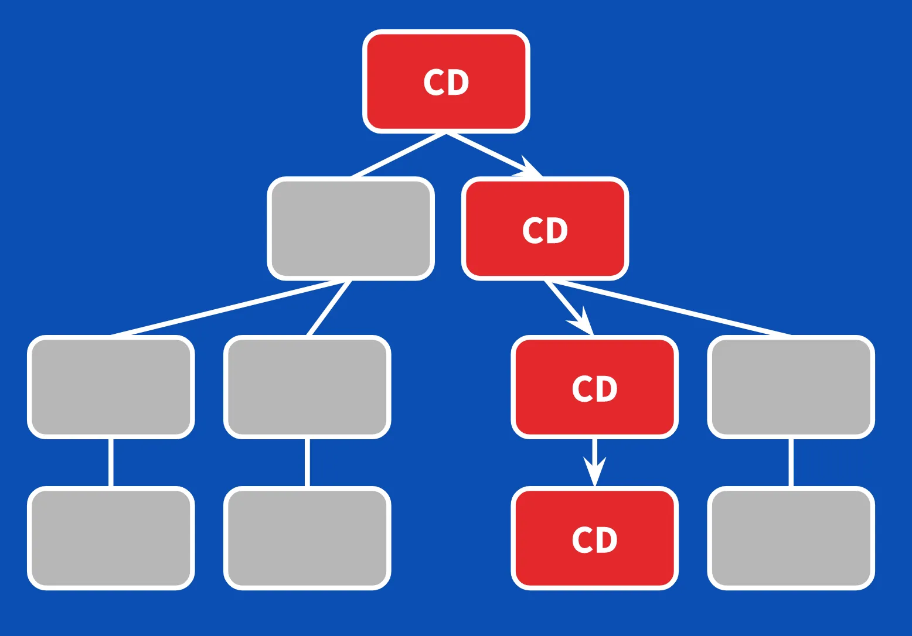

# Angular Optimisation Course

## Start
- `npm run dev`

## The slow app
- review:
- `src/main.ts`
- `src/app/app.config.ts`
- coding:
- `src/app/page/customer/customer.component.ts`

## OnPush strategy
- `src/app/page/customer/customer.component.ts`
- `changeDetection: ChangeDetectionStrategy.OnPush,`
- 

## Pipes
- `ng g pipe pipe/geo`
- `src/app/pipe/geo.pipe.ts`
- `src/app/page/customer/customer.component.html` using pipe

## Memoize
- `src/app/pipe/geo.pipe.ts`
- `https://github.com/mgechev/memo-decorator`
- `npm i memo-decorator`
- Implementing the decorator.

## LoadComponent
- 
